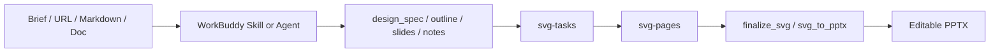
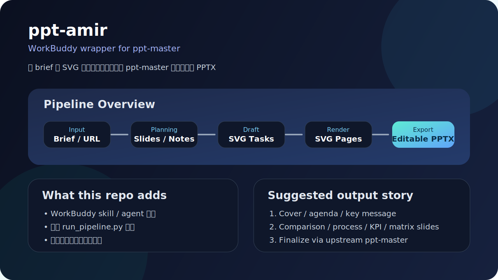
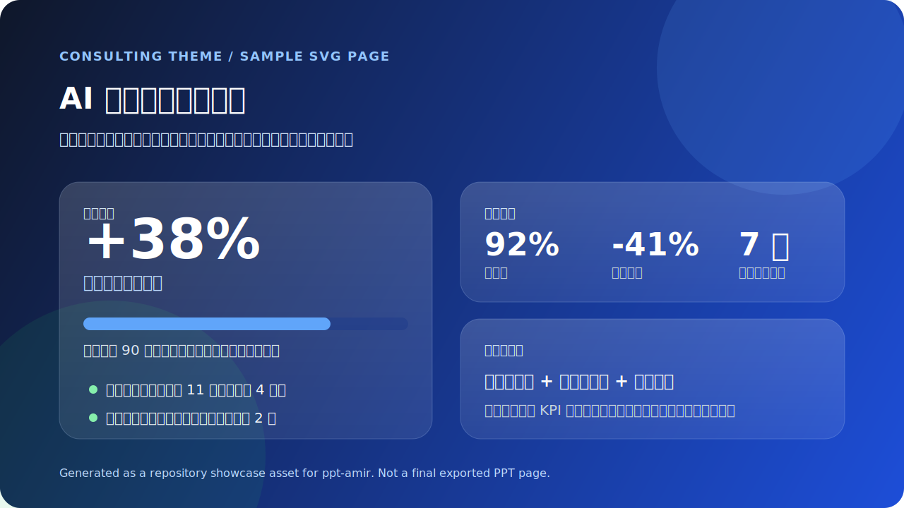

# ppt-amir


把 `hugohe3/ppt-master` 整理成一个更适合 WorkBuddy 使用的完整仓库，包含可直接复用的 skill、agent、参考文档、执行脚本，以及一个最小可用示例项目。

> 这不是上游 `ppt-master` 的替代品，而是它的 WorkBuddy 封装层。
> 真正导出 SVG/PPTX 时，仍然需要你准备好上游 `ppt-master` 仓库和依赖环境。

## 一眼看懂

| 项目 | 说明 |
| --- | --- |
| 仓库定位 | `ppt-master` 的 WorkBuddy skill + agent + pipeline wrapper |
| 适用场景 | 商务汇报、路演 deck、知识卡片、课程讲义、营销图文 |
| 主要产物 | `SKILL.md`、agent 定义、pipeline 脚本、参考文档、最小示例 |
| 是否直接替代上游 | 否，这里是封装层，不是完整渲染引擎本体 |
| 上手方式 | 先准备上游 `ppt-master`，再用本仓库的统一入口驱动流程 |

## 流程概览



## 仓库预览

下面这张图不是最终 PPT 截图，而是这个仓库当前封装层的流程示意图，适合放在 GitHub 首页第一屏，帮人快速理解它到底做了什么：



## 示例输出会长什么样

当前仓库内置的是“最小可用输入”和“流程封装”，不是直接附带一堆导出的 PPT 成品。但你可以把最终结果大致理解成下面这条链路：

1. `brief / URL / markdown / docx`
2. 生成 `design_spec.md`、`notes/outline.md`、`slides.md`
3. 生成 `tasks/*.md`
4. 渲染 `svg-pages/*.svg`
5. 交给上游 `ppt-master` 输出可编辑 PPTX

比较典型的一套输出会包含：

- 封面页 / 章节页
- 对比页 / 流程页 / 时间线页
- KPI 页 / 数据高亮页 / 矩阵页
- 最终汇总页或结论页

### 示例输出页（模拟 SVG 草稿页）

下面这张图不是从真实业务项目里截出来的成品，而是专门为仓库 README 准备的一张“模拟输出页”。它的作用是让你在不跑完整链路的情况下，先直观看到这套封装大致会产出什么风格的单页：



这张示例页故意展示了几件事：

- 标题区、说明区、指标区、结论区是怎么分层的
- `consulting` / `business-dark` 这类主题大概会是什么审美方向
- `hero` / `kpi-grid` / `data-highlight` 组合时，页面会长得更像“真演示稿”，而不是纯线框图

如果你只是想快速验证链路是否通了，建议先跑最小示例项目，看到 `slides.md`、`tasks/`、`svg-pages/` 这几层顺利生成，再去接最终导出。这样更稳，也更少被上游依赖教育做人。

## 仓库包含什么


- `skills/ppt-master/`
  - `SKILL.md`：WorkBuddy skill 定义
  - `references/`：使用说明、环境配置、执行接线、脚手架、SVG 阶段文档
  - `scripts/`：统一入口与中段生成脚本
- `agents/`
  - `ppt-master-agent.md`：演示文稿生产代理定义
  - `references/`：agent 使用与执行说明
- `examples/`
  - `minimal-brief.json`：最小结构化 brief 示例
  - `minimal-project/`：最小可用项目示例
- `LICENSE`
  - 默认使用 MIT License

## 仓库结构

```text
ppt-amir/
  agents/
    ppt-master-agent.md
    references/
  examples/
    minimal-brief.json
    minimal-project/
      design_spec.md
      notes/
        outline.md
      sources/
        brief.md
  skills/
    ppt-master/
      SKILL.md
      references/
      scripts/
  LICENSE
  README.md
```

## 主要能力

### 1. WorkBuddy skill 封装
- 将 PDF、DOCX、URL、Markdown、纯文本等内容转成可编辑 PPTX 的完整流程说明
- 支持项目脚手架、brief 打包、slides 规划、notes 汇总、SVG 任务单生成与 SVG 草稿页生成
- 保留对上游 `ppt-master` 工作流的兼容性

### 2. WorkBuddy agent 封装
- 用 agent 驱动演示文稿生产链路
- 强制按“需求确认 -> 设计规范 -> 中段生成 -> SVG -> PPTX”推进
- 适合做商务汇报、路演 deck、课程讲义、营销图文、知识卡片

### 3. 中段流水线脚本
统一入口：

```bash
python skills/ppt-master/scripts/run_pipeline.py
```

支持的阶段包括：
- `check`
- `scaffold`
- `bundle`
- `slides`
- `notes`
- `svg-tasks`
- `svg-pages`
- `init`
- `import`
- `validate`
- `finalize`
- `run`

### 4. 草稿页增强能力
内置：
- 版式识别
- 页级文案改写
- subtitle / takeaway / supporting bullets 生成
- 结构化版式字段
- 文本压缩与轻量组件提示
- 多主题系统：`default` / `dark` / `tech-blue` / `business-dark` / `brand-light` / `consulting`
- 主题差异可下沉到 `chip`、`callout`、`cover`、`comparison`、`hero`、`kpi-grid`、`section-divider`、`data-highlight` 等组件层

## 先决条件

### 必需
- Python 3.10+
- 一个可访问的上游 `ppt-master` 仓库

### 可选
- Node.js 18+
- Pandoc
- Cairo / cairosvg
- 图片生成 API Key（如果要启用 AI 生图）

详细说明见：
- `skills/ppt-master/references/setup.md`
- `skills/ppt-master/references/execution-wiring.md`

## 快速开始

### 1. 准备上游仓库

```bash
git clone https://github.com/hugohe3/ppt-master.git
cd ppt-master
pip install -r requirements.txt
```

### 2. 检查封装层和上游仓库是否可用

```bash
python skills/ppt-master/scripts/run_pipeline.py --repo C:\path\to\ppt-master check
```

### 3. 直接用最小示例 brief 生成项目包

```bash
python skills/ppt-master/scripts/run_pipeline.py bundle --brief examples\minimal-brief.json --project-root C:\work\ppt-jobs --project-name demo-deck
```

### 4. 继续执行中段和 SVG 草稿阶段

```bash
python skills/ppt-master/scripts/run_pipeline.py slides --project-path C:\work\ppt-jobs\demo-deck
python skills/ppt-master/scripts/run_pipeline.py notes --project-path C:\work\ppt-jobs\demo-deck
python skills/ppt-master/scripts/run_pipeline.py svg-tasks --project-path C:\work\ppt-jobs\demo-deck --create-svg-stubs
python skills/ppt-master/scripts/run_pipeline.py svg-pages --project-path C:\work\ppt-jobs\demo-deck --force --theme consulting
```

### 5. 最终导出

```bash
python skills/ppt-master/scripts/run_pipeline.py --repo C:\path\to\ppt-master finalize --project-path C:\work\ppt-jobs\demo-deck
```

## 最小可用示例项目

仓库自带：

- `examples/minimal-brief.json`
- `examples/minimal-project/design_spec.md`
- `examples/minimal-project/sources/brief.md`
- `examples/minimal-project/notes/outline.md`

你可以把它当成一个最小 smoke case：
- `minimal-brief.json` 负责演示结构化输入长什么样
- `minimal-project/` 负责演示项目初始化后的最小骨架
- 如果后续顺利生成出 `slides.md`、`tasks/*.md`、`svg-pages/*.svg`，就说明这层封装基本接通了

适合拿来快速理解：
- brief 长什么样
- 项目初始化后目录大致长什么样
- 演示内容在进入 `slides.md` 前应该如何组织
- 最小示例跑通后，中间产物会落在哪几层目录


## 推荐使用方式

### 场景 A：只做规划
输出这些东西就够了：
- `design_spec.md`
- `notes/outline.md`
- 下一步执行建议

### 场景 B：一路跑到 PPTX
建议顺序：
1. `check`
2. `scaffold` 或 `bundle`
3. `slides`
4. `notes`
5. `svg-tasks`
6. `svg-pages`
7. `finalize`

别一上来就 `finalize`，那样通常只会得到一个更快的报错。

## 仓库清理说明

这次整理时做了几件事：
- 把可复用内容收敛成 `skills/`、`agents/`、`examples/` 三层结构
- 补上 `LICENSE`
- 去掉文档里对本仓库内不存在脚本的误导性调用说明，统一改成对上游仓库或统一入口脚本的描述
- 保持仓库只承载 WorkBuddy 封装层，不把无关个人配置一起塞进来

## 后续建议

如果你要继续把这个仓库做得更像一个可分发项目，下一步我建议补这几个：
- GitHub Releases
- 中英文双语 README
- 示例输出截图
- 一份更完整的 `examples/demo-brief-enterprise.json`
- 更细的脚本 smoke test 与示例产物校验

## CI

仓库已经带了一个最小 GitHub Actions：

- `.github/workflows/repo-check.yml`

当前会自动检查：
- README / LICENSE / skill / agent / 示例文件是否存在
- `run_pipeline.py --help` 是否可执行
- 主要子命令的 `--help` 是否能正常输出

这不是完整集成测试，但足够先防止仓库结构被改坏。

## License


MIT
